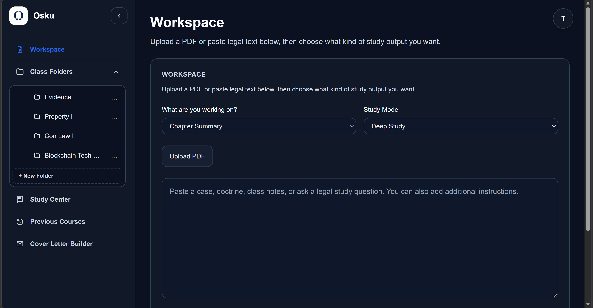
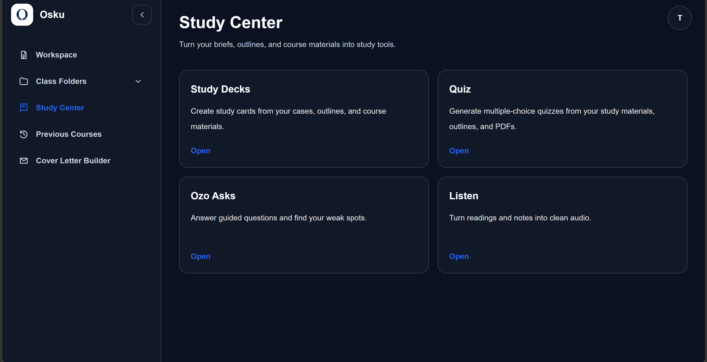
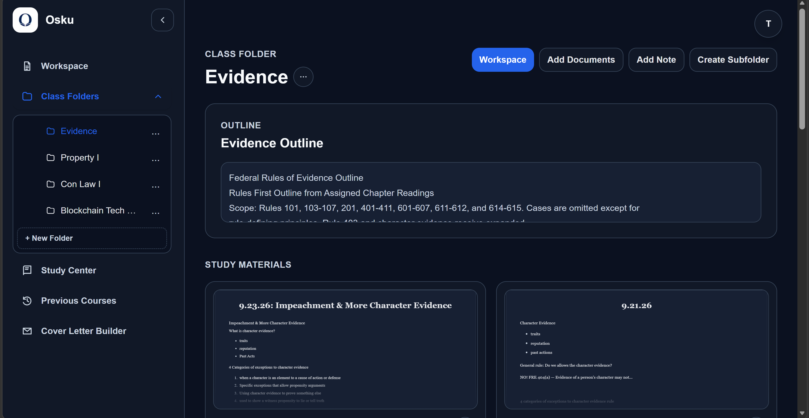
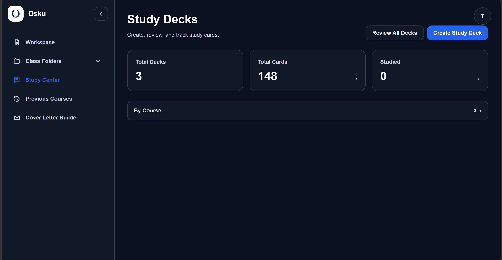

## Hi there👋

I'm a law student interested in legal technology, artificial intelligence, cybersecurity, and emerging technology law.

## Currently Building

### Osku

Osku is a law-school study platform I'm currently developing. It brings together outlining, case briefing, flashcards, quizzes, and AI-assisted study tools in one workspace.

The production repository is private while development is ongoing.

### Preview

## Interests

- Legal technology
- Artificial intelligence and law
- Blockchain and digital identity
